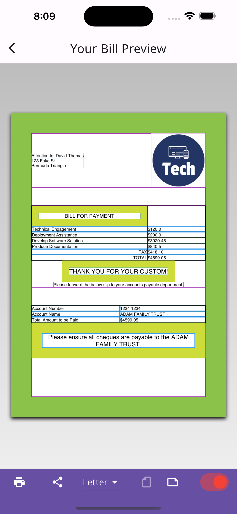
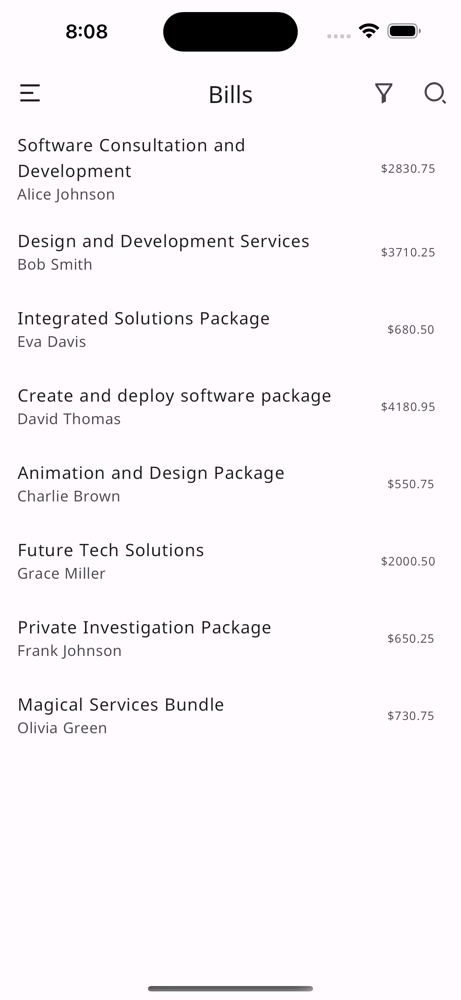
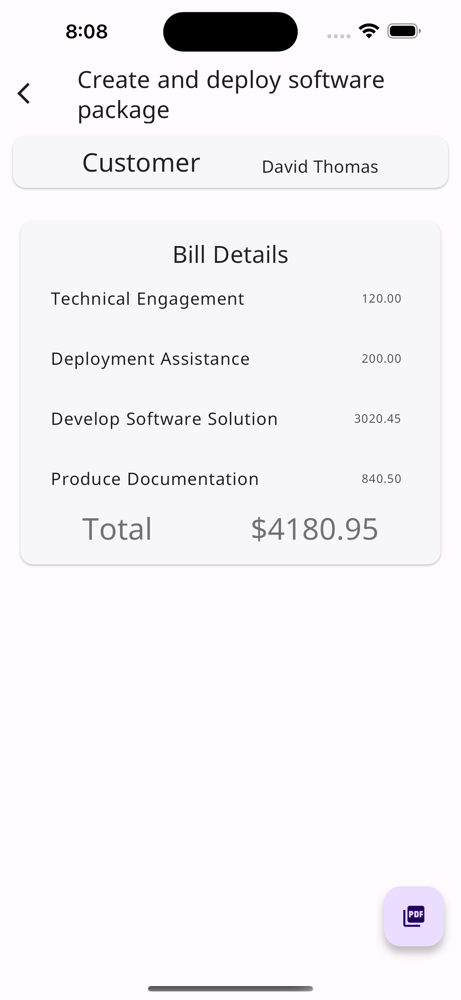
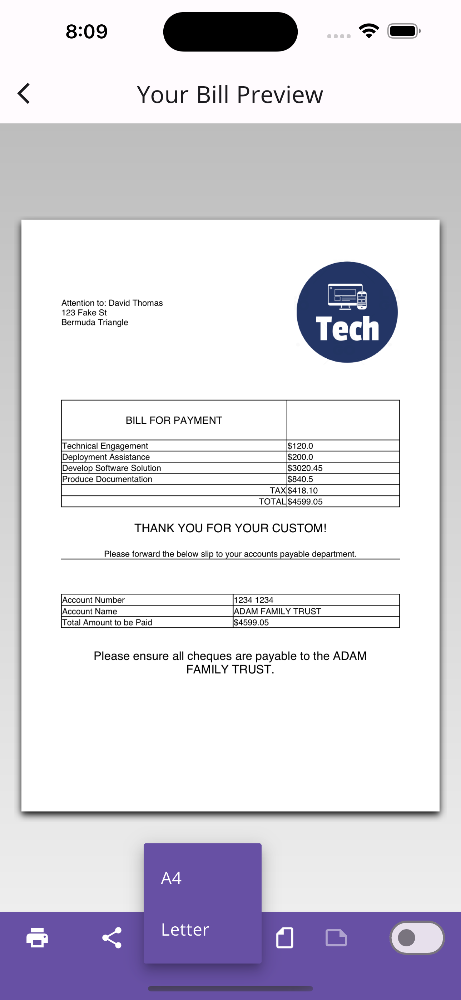

# 💼 BillCraft - Invoice and Billing App with PDF Export

BillCraft is a powerful Flutter application designed to help users generate, preview, and export invoices as professional PDFs. Ideal for freelancers, shop owners, and small businesses who need a clean and efficient way to manage billing on the go.

---

## ✨ Features

- 🧾 **Bill Generation** – Create itemized bills with customer details.
- 👁️ **Preview Mode** – View the invoice before saving/exporting.
- 📄 **PDF Export** – Generate high-quality, printable PDFs of your invoices.
- 📊 **Structured Data** – Uses a model-based architecture (`BillModel`) for clean data management.
- ⚙️ **Modular Codebase** – Organized in screens, helpers, and models.
- 📱 **Mobile Ready** – Flutter-based app optimized for mobile usage.

---

## 📸 Screenshots

> Replace with actual screenshots later

### 🏠 Home / Bill Form & PDF Preview

<p align="center">
  
  
</p>

<p align="center">
  
  
</p>

---

## 🚀 Getting Started

### Prerequisites

- Flutter SDK (latest stable)
- Dart
- Android Studio or VS Code

### Installation

```bash
git clone https://github.com/your-username/billcraft.git
cd billcraft
flutter pub get
flutter run

